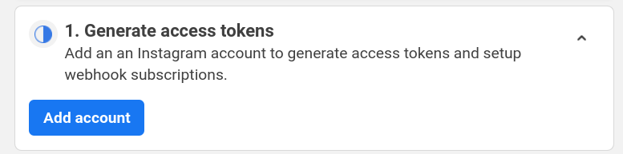
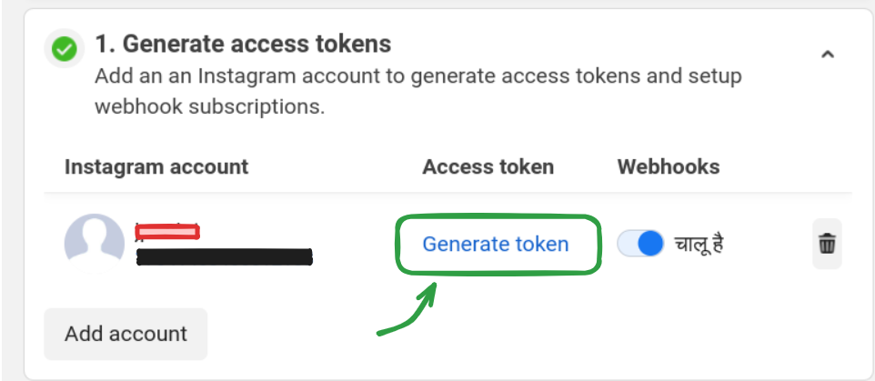
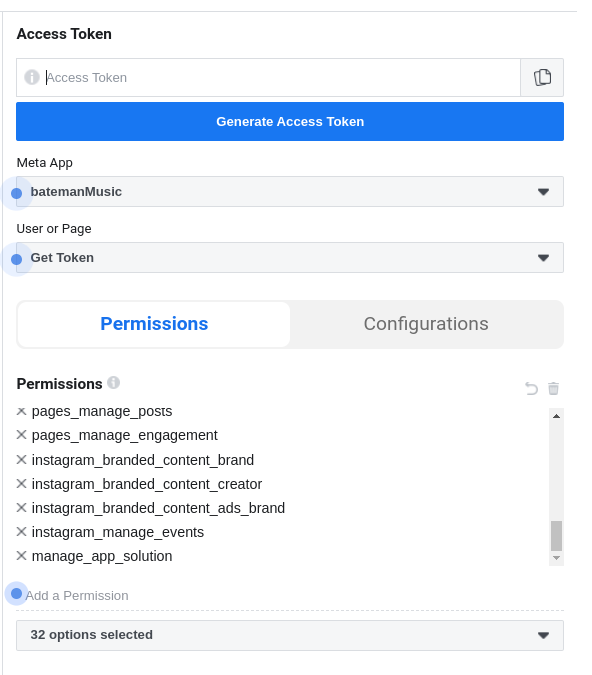

.. _setup:

Setup
#####

1. Facebook & Instagram setup
=============================

1. Make a Facebook account
2. Make a Facebook Page using that account. `steps <https://www.facebook.com/business/help/1199464373557428?id=418112142508425>`_
3. Make an Instagram account using the same email
4. Change the Instagram account type to professional (not private, nor public)
5. Connect the Facebook page to the Instagram account. `steps <https://www.facebook.com/business/help/connect-instagram-to-page>`_
6. On the Facebook (Meta) developer site, register yourself, and create a new app. The interface keeps on changing, so it's kinda useless to document exact steps and screenshots. Remember to create a Business type app as opposed to Consumer type app.
7. Open *Add products to your app* page if it doesn't open automatically. Add the product named "Instagram" by clicking on "Set-up".
8. On the page *API setup with Instagram business login*, generate access tokens by adding your instagram account

9. Click Generate token, login to Instagram on the popup window, and allow permissions. Finally, copy the access token.

10. Open Graph API Explorer. Select your app . Select *Get User Access Token*.
11. Add permissions. Facebook documention is dumb as hell. I ain't wasting another minute reading that shit. Do one of these two or else this apeshit API won't work:
    - Add every fucking permission available
    - Figure out what permissions and scopes are required to publish content
12. Click *Generate Access Token*. This is a short lived token. We'll exchange this for a long lived token.

13. In a .env file, set FB_ACCESS_TOKEN as the short lived token, generated in step 12.

14. Find your PAGE_ID by running `get_user_pages.py` or these `steps <https://www.facebook.com/help/1503421039731588>`_. Set this in the .env file

15. Find your INSTAGRAM_ACCOUNT_ID by running `get_instagram_account.py` or go to https://accountscenter.instagram.com/profiles/ , click on your username, the url in the browser will change to `https://accountscenter.instagram.com/profiles/<INSTAGRAM_ACCOUNT_ID>`. Set this in the .env file

16. Setup these environent variables in the *.env* file
    - FB_ACCESS_TOKEN
    - FB_CLIENT_ID
    - FB_CLIENT_SECRET
    - GRAPH_DOMAIN='https://graph.facebook.com/'
    - GRAPH_VERSION='v21.0'
    - PAGE_ID
    - INSTAGRAM_ACCOUNT_ID
    - IG_USERNAME

When facebook access token gets expired
----------------------------------------
1. Follow the steps 10,11,12,13 to get a new short lived token.
2. Run `long_lived_access_token.py` to get a new long lived access token
3. In the .env file, set FB_ACCESS_TOKEN as this new token.

2. Imgur setup
==============

1. Create an app on imgur, and set the following in the .env file:
    - IMGUR_CLIENT_ID
    - IMGUR_CLIENT_SECRET
    - IMGUR_ACCESS_TOKEN
    - IMGUR_REFRESH_TOKEN

- IMGUR_CLIENT_ID & IMGUR_CLIENT_SECRET can be found on the Imgur Dashboard
- Get IMGUR_ACCESS_TOKEN & IMGUR_REFRESH_TOKEN by opening this link in your browser -> https://api.imgur.com/oauth2/authorize?client_id=YOUR_CLIENT_ID&response_type=token&state=APPLICATION_STATE
  (Replace YOUR_CLIENT_ID with the client id you got from registering your application)
  *You will be redirected to a new url*
- Extact the access token from the url
- Extact the refresh token from the url
- Set them in .env file
- Now if the token gets expired, run `generate_access_token.py` to get the new access token and refresh token

3. Spotify setup
================
1. Create a new app on Spotify Developer Dashboard (only *WebAPI App* needed).
2. Set the redirect URI as anything, it won't matter
3. Save the following in the .env file
    - SPOTIPY_CLIENT_ID
    - SPOTIPY_CLIENT_SECRET
    - SPOTIPY_REDIRECT_URI

4. FFMPEG
==========
- Download, install & add FFMPEG to $PATH variable

5. Repo & Bash setup
=====================
1. **Clone the repo**:

.. code-block:: bash

    gh repo clone codeblech/batemanRecords

2. Place the .env file in root of the repo directory
3. **Install poetry**:

.. code-block:: bash

    curl -sSL https://install.python-poetry.org | python3 -

4. **Install dependencies**:
From root of the repo, run:

.. code-block:: bash

     `poetry install`

5. **Create an alias for this command**:
Write  in `~/.bashrc` file:

.. code-block:: bash

    alias bateman="PATH/TO/BATEMAN.SH"

6. **Reload the bashrc file**:

.. code-block:: bash

    source ~/.bashrc

Note
====
- Some of the Facebook & Instagram steps might seem repetitive. That's because they probably are. gotta blame facebook for that.
- All of the following are different (yet, confusingly similar):
    - `access_token`
    - `client_id (FB App ID)`
    - `client_secret (FB App Secret)`
    - `Instagram app ID`
    - `Instagram app secret`
    - `page_id`
    - `instagram_account_id`
    - `instagram_username`
- Run `debug_access_token.py` to get info(type, expire_time, scopes, etc) about the access token set in the .env file as ACESS_TOKEN